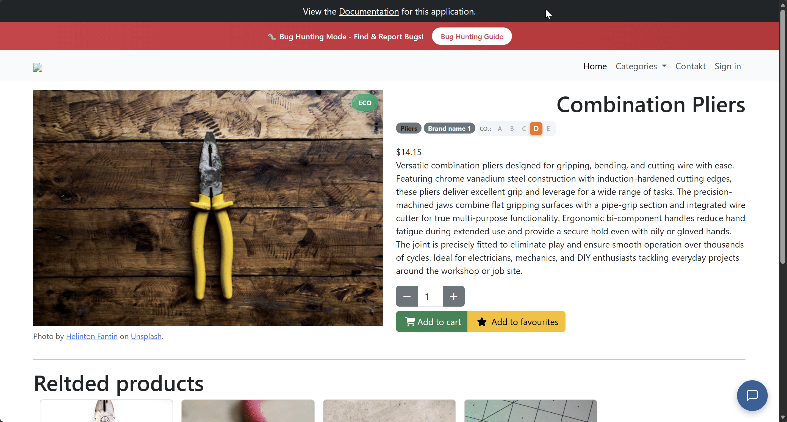
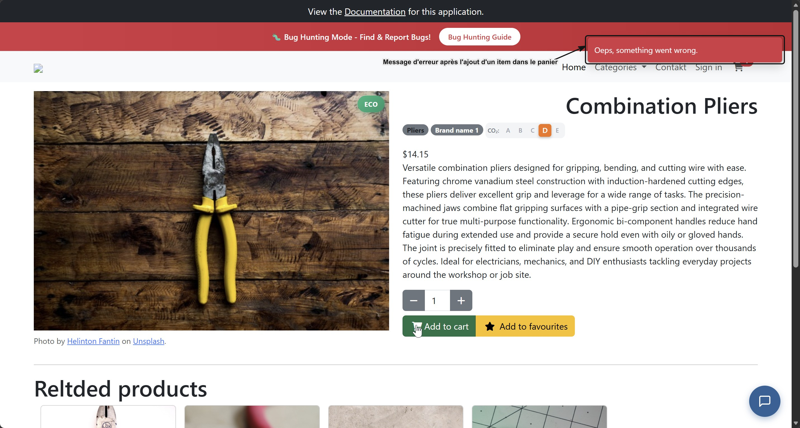

## Contexte

Anomalie detectée lors de ma session exploratoire **Session n°1** : Panier
Lors de l'ajout d'un article depuis sa page produit, un message d'erreur apparait

***Objectif de l'investigation:***
Déterminer si le comportement est récurrent, un problème d'affichage

## Symptôme observé

        Clic d'ajout au panier : OK
        L'item ajouté au panier : OK
        Message d'erreur dès le clic d'ajout au panier

## Hypothèse

    + Message prévenant une erreur liée par défaut au bouton Add to cart
    

## Test pour vérifier

    + Observer les requêtes network

## Conclusion

***Constatation faite :*** Le message d'erreur s'affichera toujours dès l'ajout de n'importe quel item au panier tant que le message ne sera pas associé au réel comportement
Ne nécessite pas d'analyse de défaillance 
Reférence du rapport : **bug-report_001**