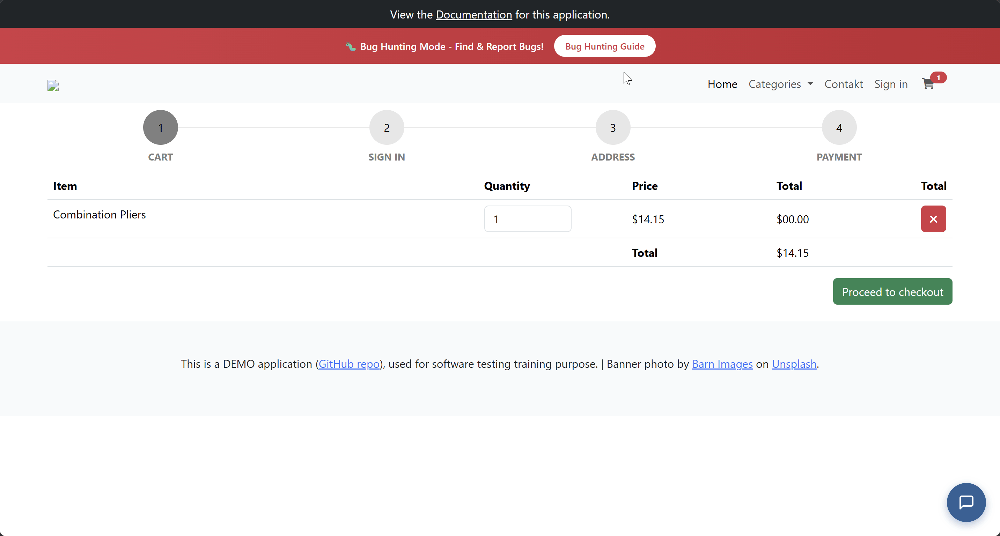
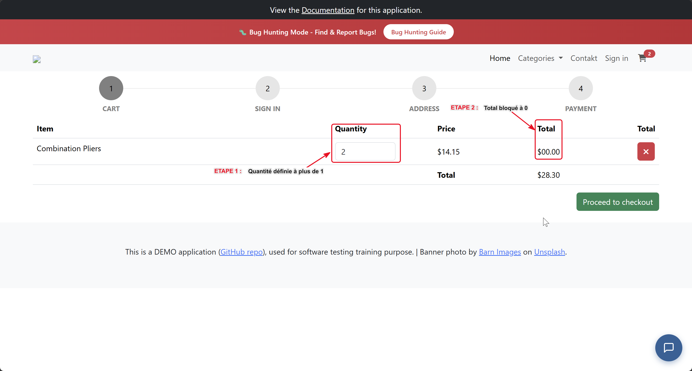

## Contexte

Anomalie détectée lors de ma session exploratoire **Session n°1** : Panier
La modification de la quantité produit dans le panier n'impacte aucunement le total du produit

***Objectif de l'investigation :***
Déterminer la connexion logique entre le champ de quantité et le total, examiner le comportement du total côté front

## Symptôme observé

    + Quantité modifiée : OK
    + Total du produit restant à 0
    Aucun message d'erreur lié au changement non pris en compte
       

## Hypothèse

    + Total produit étant une (boîte vite) qui n'est pas lié au champ quantité produit
    

## Test pour vérifier

    + Verifier le code contenant un script ou quelque chose qui lie les deux fonctions

## Conclusion

***Constatation faite :*** Le code lié à la fonction total, ne contient que du code statique qui sera toujours == 0
Ne nécessite pas d'analyse de défaillance.
Référence du rapport **bug-report_002**